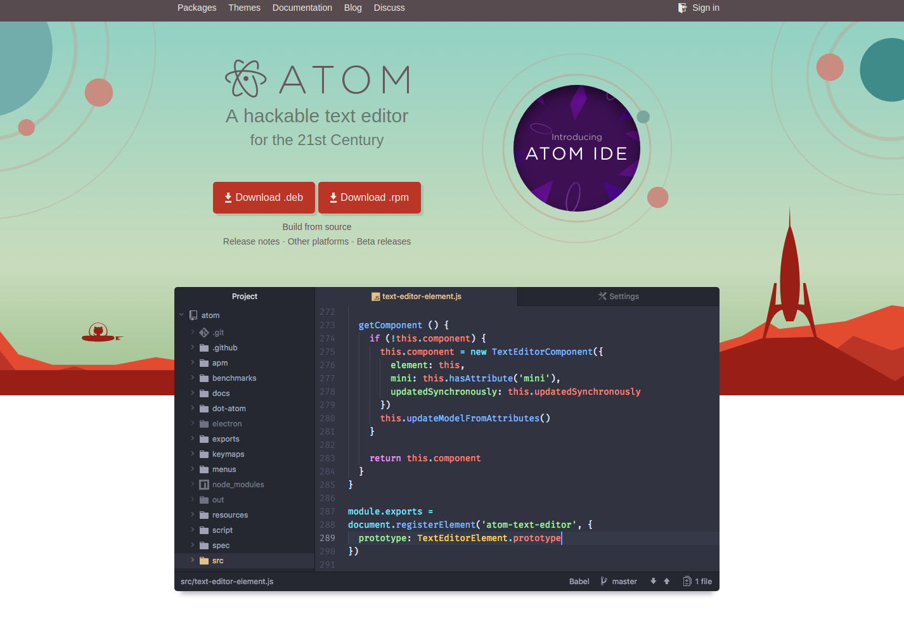
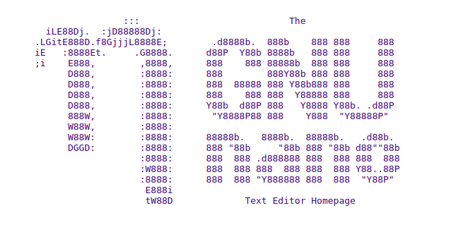

# Short Guide to Using Alternative IDEs

# Table of Contents
1. [Atom](#Atom)
2. [Nano](#Nano)
3. [Vim](#Vim)

## Atom
The [Atom Editor](https://create.arduino.cc) is a popular choice for development that supports plugin architecture to extend the functionality of the IDE.

Here we will walk through the steps needed for installing Atom on a development computer and configuring it to push code to a remote computer environment.



### Choose the Atom Instructions for Your Operating System

The installation instruction will vary a little depending on the operating system of your development computer. Click on the instructions that are closest for your operating system.
[Ubuntu](docs/atom-install-ubuntu.md), [Windows 10](docs/atom-install-windows.md) or [MacOSX](docs/atom-install-mac.md).

## Nano
GNU nano is a small and friendly text editor. Besides basic text editing, nano offers many extra features, such as an interactive search-and-replace, undo/redo, syntax coloring, smooth scrolling, auto-indentation, go-to-line-and-column-number, feature toggles, file locking, backup files, and internationalization support.



## Overview of Installation and Configuration steps
1. Use SSH to get a console on the remote device.
2. If Nano is not pre-installed then use the **apt** command to install it.
  ```sh
  $ sudo apt install nano
  ```
3. At the command line, start the editor

## Vim
Vim is a highly configurable text editor built to make creating and changing any kind of text very efficient. It is included as "vi" with most UNIX systems and with Apple OS X.

Vim is rock stable and is continuously being developed to become even better. Among its features are:
* persistent, multi-level undo tree
* extensive plugin system
* support for hundreds of programming languages and file formats
* powerful search and replace
* integrates with many tools


1. Use SSH to get a console on the remote device.
2. If Vim is not pre-installed then use the **apt** command to install it.
   On an Ubuntu system the install command is as follows:
  ```sh
  $ sudo apt install vim
  ```
3. At the command line, start the editor
```sh
$ vim
```
