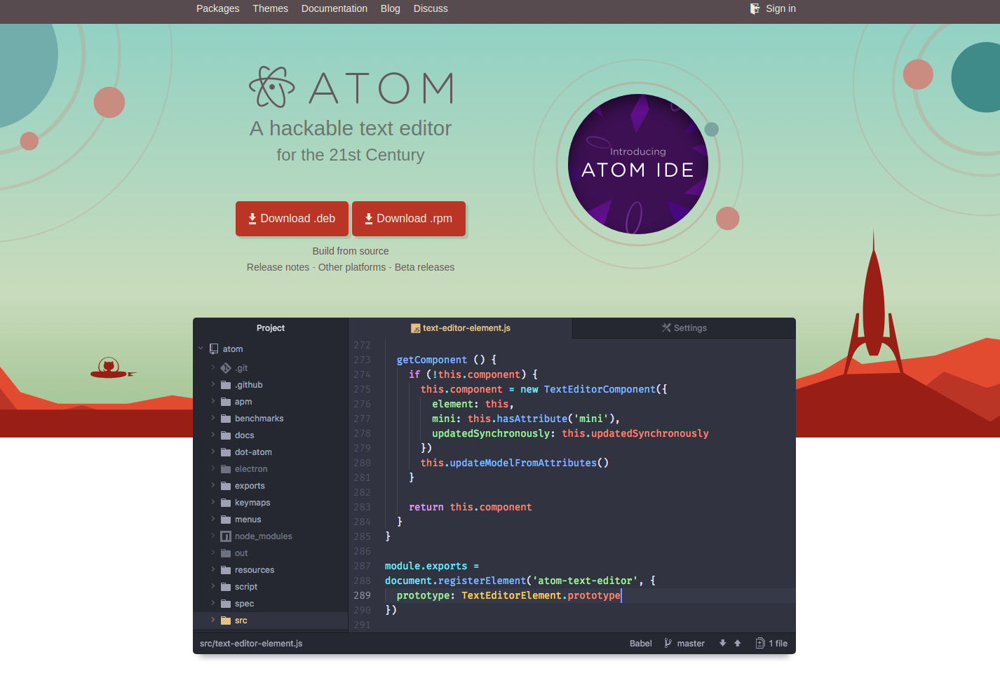
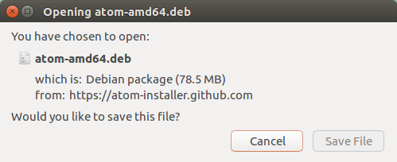
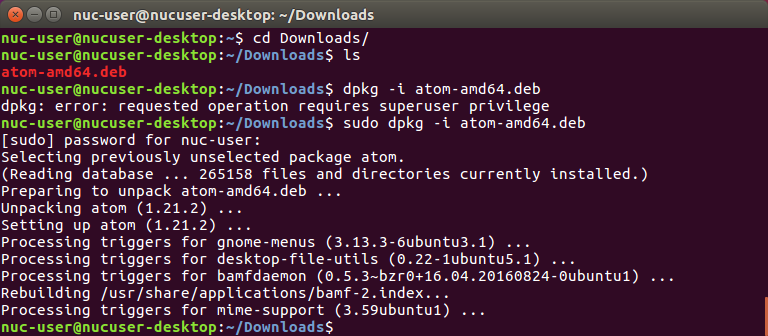
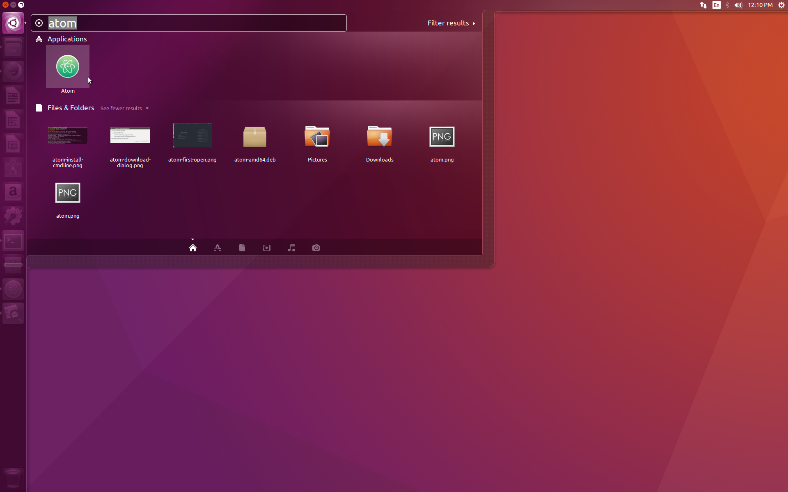
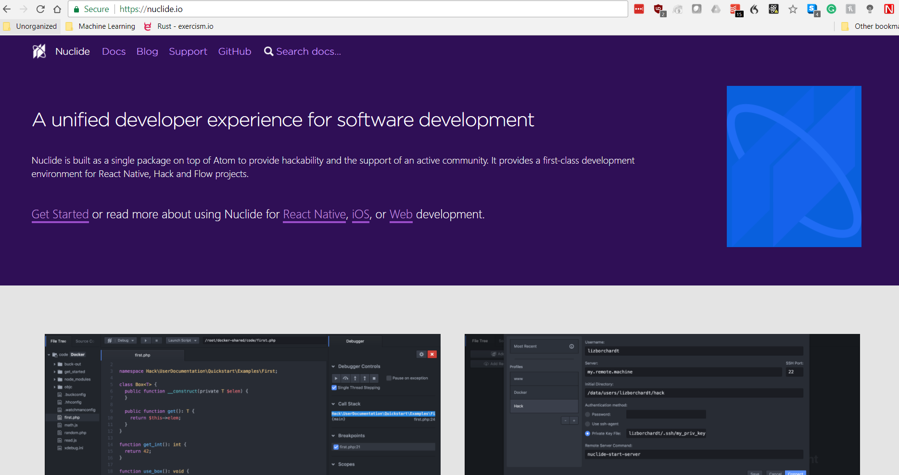
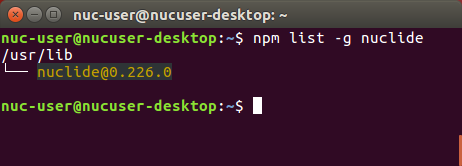
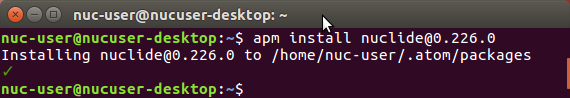
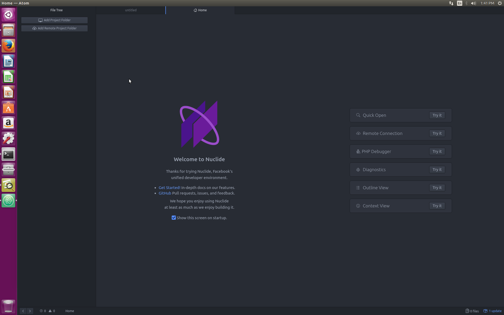
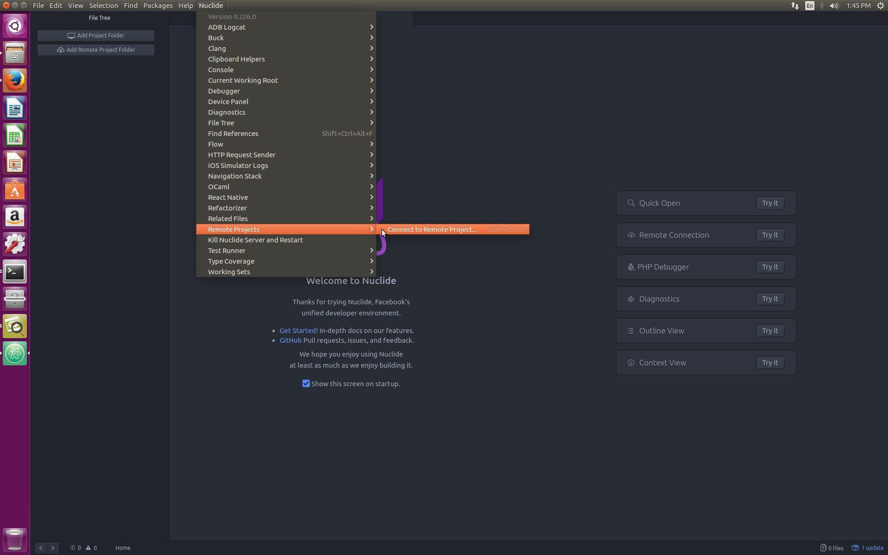
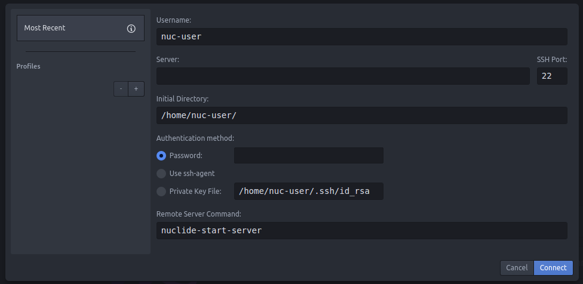

# Ubuntu

## Software Versions Used in this document
These instructions were tested using the following software.
* Ubuntu Desktop 16.04 TLS
* Nuclide 0.226.0

## Install the Atom Editor on your Development System
1. Download and Install the **.deb** package for Atom Editor from [https://atom.io/](https://atom.io/)


2. Click on the **Save File** button, even if it is grayed out.


3. Open a command line terminal and type the following to install the Debian package file.
    ```sh
    cd ~/Downloads/
    sudo dpkg -i atom-amd64.deb
    ```
    

4. Now you can launch the Atom Editor
    
    

### Install the Nuclide Plugin for the Atom Editor

Nuclide is a development environment for the Atom Editor that includes the ability to save files to a remote host. We will be using it to synchronize files to your remote computer.



**You will need to install a specific version that matches the version of the Nuclide server on your remote device**. This means that rather than using the plugin manager in Atom, you **must use the command line** to install a specific version.

### Check the version of the Nuclide server installed on your remote computer.

1. To do this you must SSH to the remote system.
   ```sh
   ssh nuc-user@192.168.x.x
   ```
   **Note: Be sure to use the IP address of your remote computer.**
2. On the remote system's command line, type:
    ```sh
    npm list -g nuclide
    ```
    

3. Now back on your development computer, you need to download the version of the Nuclide plugin that matches the version on your remote system.  **Open a new terminal on your development computer**

4. At the command line, type:
    ```sh
    apm install nuclide@0.226.0
    ```
    **Note: 0.226.0 is the version number. Be sure this matches the version that you found on you remote computer.**

    

5. Finally, quit the Atom Editor. You will need to restart it to load the Nuclide Plugin.

### Setup your connection to the remote computer

You should now have the Atom Editor and Nuclide plugin installed.
The Welcome to Nuclide page should be open on starting the Atom Editor.



1. Click on the Nuclide menu and select **Nuclide -> Remote Project -> Connect to Remote Project

  

  The Remote Project Dialog will open.
  

2. Enter your remote computers IP address in the Server field
3. Enter your password
4. Enter the directory on the remote computer in the Inital Directory field.
5. Press the connect button.
It should look like this.


### Congratulations, you can now save files to the remote computer!
